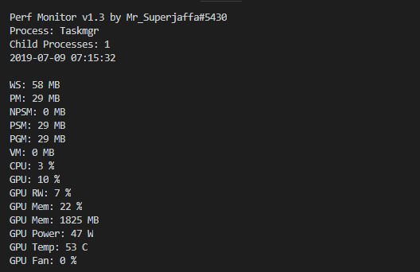
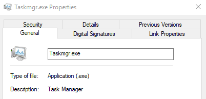
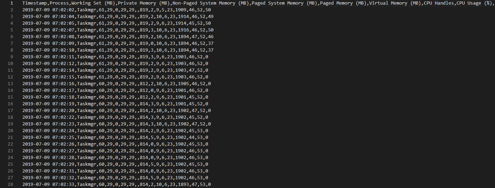

# Performance Monitor for Windows & NVIDIA GPUs
####Version 1.2 by Mr_Superjaffa#5430
####Thanks to Alexey Kamenev for his GPUPerfCounters

The goal with this project was to collect system perfomance data in regards to a specified application and output this to CSV.



#### Requirements
1. NVIDIA GPU. Both TCC and WDDM Modes are supported. AMD GPU support not guaranteed.
2. Lastest [drivers](http://www.nvidia.com/Download/index.aspx).

#### Install:
1. Run the following command line from the GpuPerfCounters folder, this may require administrator privileges:
```
GpuPerfCounters.exe -install
```
2. Now that the GPU performance counters service is installed, we start it with:
```
sc start GpuPerfCounters
```
3. Open up the `PerfMonitorConfig.xml` file and configure to your needs.

`<Process>Taskmgr</Process>`: This the executable name, without the .exe.
`<CycleTime>0</CycleTime>`: This will ADD time to the cycles. By default the script should cycle every second.
`<LogFolder>./Logs</LogFolder>`: Specify a specific log folder here.


    
4. Run the `PerfMonitorStart.bat`, it will momentarily begin collecting data in CSV format.



#### Uninstall
1. Stop the `GpuPerfCounters` service through command line:
```
sc stop GpuPerfCounters
```
2. Remove the service from the registry:
```
GpuPerfCounters.exe -uninstall
```

#### Limitations

1. GPU data is system wide, not application specific. Everything else is fine.